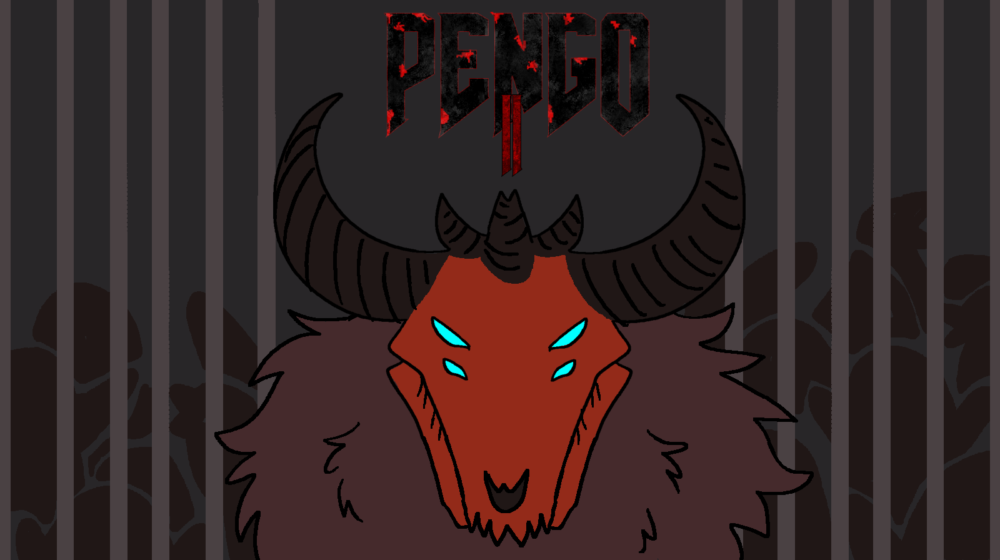

#Pengon

## Introduction

**Pengo2** is a 2D dungeon-based puzzle game developed by the University of Utah Master of Entertainment Art & Engineering Cohort9 rapid prototype2 team7 students. This game is inspired by the classic arcade game , *Pengo*, which is made by SEGA in 1982. And it released in **itch.io** now. Play it [here](https://tezika.itch.io/pengo2) !

## How to run the project locally?

### Requirements

We need [Node.js](https://nodejs.org) to install and run scripts.

###Install and run

Run next commands in your terminal:

| Command | Description |
|---------|-------------|
| `npm install` | Install dependencies and launch browser with examples.|
| `npm start` | Launch browser to show the examples.   Press `Ctrl + c` to kill **http-server** process. |
=======
